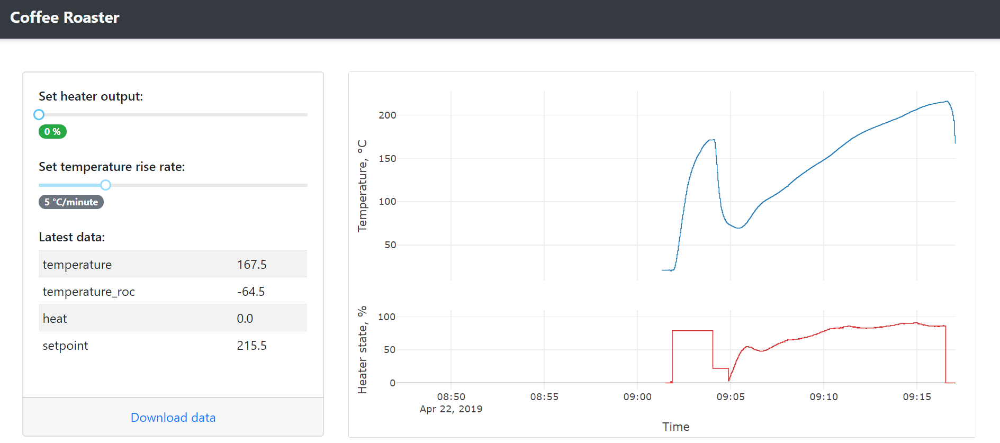
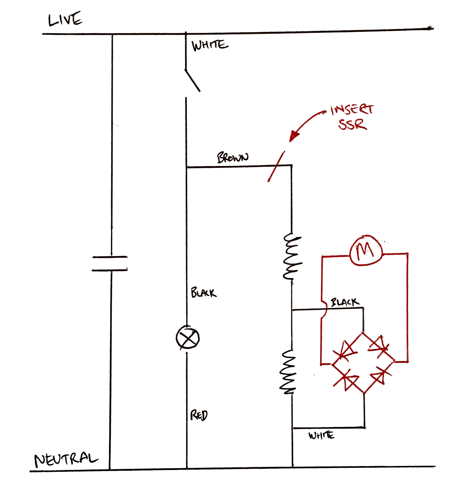

# Raspberry Pi Coffee Roaster

This software can control a popcorn-maker for use as a coffee roaster. It allows for precise control of temperature during the roasting process.

## Requirements

1.  Raspberry Pi;
2.  Popcorn maker, modified with a solid-state relay to allow the heater circuit to be turned on/off;
3.  Type K thermocouple to measure the temperature inside the popcorn roaster, aloong with a [MAX31855](https://www.adafruit.com/product/269) circuit to connect it to the Raspberry Pi;
4.  DC power supply to run the popcorn maker's fan; and
5.  Account with [balena.io](https://www.balena.io/) to deploy the Raspberry Pi software.

## Initial setup

The software contains three main components:

1.  A [Node-RED](https://nodered.org/) flow, which reads the thermocouple and controls the solid-state relay;
2.  A [Redis](https://redis.io/) database to store data logged by Node-RED; and
3.  A [Dash](https://plot.ly/products/dash/) web interface to view and control the device.

Push the repo to Balena and add the `USERNAME` and `PASSWORD` environment variables to the device. These contain the login credentials for Node-RED - see [here](https://github.com/balena-io-projects/balena-node-red) for instructions on how to create the password.

To view/edit the control flow, go to `http://$RASPBERRY_PI_ADDRESS:8080`.  For the main user interface go to `http://$RASPBERRY_PI_ADDRESS`.

## Usage

A typical roast profile runs as follows:

1.  Switch on fan motor and use the top slider in the web interface to turn the heater on high. This will pre-heat the machine.
2.  Turn heat down to 20% before adding green coffee beans (this helps to avoid scorching the beans).
3.  As the temperature drops and starts to bottom out, use the lower slider to set a desired rate-of-rise for the temperature, e.g. 15°C/minute.
4.  Lower the rate-of-rise as the roast reaches first crack.
5.  Use the top slider to drop the power to zero when the roast reaches the desired final temperature.

## Useful references

### Raspberry Pi

1.  [Wiring](https://learn.adafruit.com/max31855-thermocouple-python-library?view=all#hardware-spi-2-11) to connect the MAX31855 thermocouple circuit to the Raspberry Pi's SPI interface.
2.  [Raspberry Pi pins](https://pinout.xyz/pinout/spi) for SPI interface.

The Node-RED template is currently configured to use the following pins to connect to the MAX31855:

| SPI connection | GPIO number |
|----------------|-------------|
| CLK            | 25          |
| CS             | 24          |
| DO             | 18          |

To change these, go to the Node-RED interface and edit the **read_max31855** block so that the **command** parameter contains the desired port numbers:

    python /usr/src/thermocouple.py --clk=25 --cs=24 --do=18 --samples=10

### Node-RED

1.  Python libraries for [GPIO](https://github.com/adafruit/Adafruit_Python_GPIO) and [MAX31855](https://github.com/adafruit/Adafruit_Python_MAX31855) (required to read the thermocouple).
2.  [Node-RED MAX31855 module](https://github.com/Heatworks/node-red-contrib-adafruit-max31855).

### Redis

1.  [Redis commands](https://redis.io/commands).

### Popcorn maker schematic

